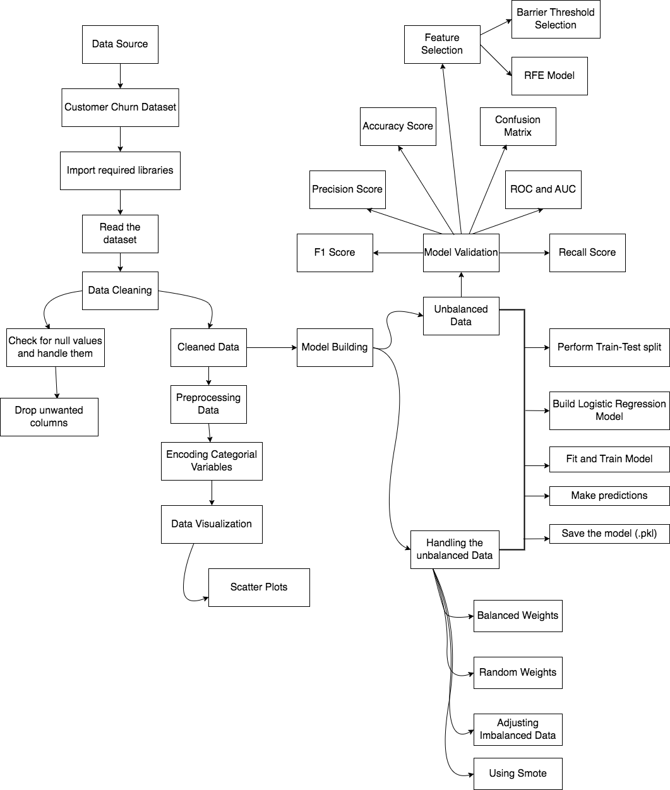

# Building a logistic regresion model with python

# Overview 

## Architecture Diagram

# Aim
To build a logistic regression model in python.

# Approach

## Tech Stack

## Data Description
[Data](https://github.com/diegovillatoromx/logistic_regresion_model/blob/main/Data/data_regression.csv)
## Complete Tutorial
